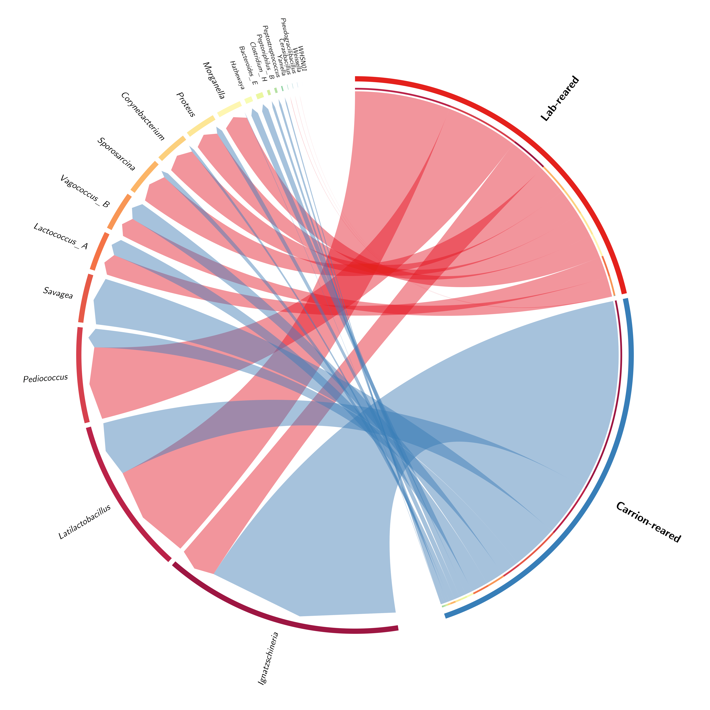
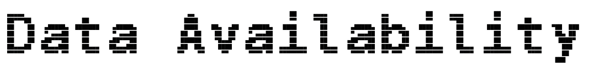

<p align="center">
  
</p>

<!-- Tech / methods -->


> [!IMPORTANT]
> This README.md file was last updated 2026-03-26. The information presented here may have changed since then.



This repository contains the code, data, and context for the manuscript titled **Environmental and developmental drivers of blow fly (Diptera: Calliphoridae) microbiome succession**. The data presented in this study was generated between 2023-2024. The repository will be updated as progress on the manuscript is made; and the accessible content will reflect this.

- [x] Data analysis
- [x] Manuscript draft
- [x] Manuscript revisions
- [x] Journal submission
- [ ] Publication

Contributors to this project and manuscript include:
- Anthony E. Grigsby, M.S. @ Colorado State University (formerly Michigan State University)
- Kelly A. Waters @ Michigan State University
- Dr. Jennifer L. Pechal @ Michigan State University
- Dr. M. Eric Benbow @ Michigan State University (corresponding author)


<br clear="right"/>

---

<p align="left">
  
</p>

> Blow flies (Diptera: Calliphoridae) are primary colonizers of decomposing vertebrate remains and play a pivotal role in terrestrial nutrient cycling and forensic investigations. Despite their ecological and applied significance, the succession and environmental determinants of their associated microbiota remain poorly understood. Here, we present a longitudinal study of blow fly microbiome dynamics across all developmental stages, contrasting laboratory-reared and carrion-reared populations. Using 16S rRNA amplicon sequencing, we characterized bacterial community composition, alpha and beta diversity, and identified core and development stage-specific taxa. Our results reveal pronounced successional shifts in the microbiome through metamorphosis, with early larval stages exhibiting high phylogenetic diversity and evenness, followed by a reduction during pupal stage and the emergence of adult-specific bacterial profiles. Notably, rearing environment exerted a strong influence on diversity and community composition: Carrion-reared flies harbored more phylogenetically and taxonomically diverse microbiomes, while laboratory-reared flies exhibited lower diversity communities dominated by a few core taxa such as Proteus and Morganella. Environmental context explained a significant proportion of microbiome beta diversity, with distinct community structure influenced by rearing condition and developmental stage. These findings underscore the importance of environmental microbial reservoirs in shaping blow fly microbiome assembly, and suggest that laboratory models may underestimate the complexity of natural insect-microbe interactions. Our study provides foundational insights for ecological, evolutionary, and forensic applications involving blow fly-microbiome dynamics.

---

<p align="left">
  
</p>

```
.
└── 2026-calliphoridae-development/
    ├── README.md
    ├── LICENSE
    ├── .gitignore
    ├── meta/            # repository assets
    ├── data/
    │   └── processed
    ├── results/
    │   ├── figures      # manuscript figures
    │   └── tables       # csv/tsv for main + supp tables
    ├── src/             # analysis code + reusable functions
    └── docs/            # text, submission files, extra documentation
```

---

<p align="left">
  
</p>

The raw sequence reads generated in this study are available in the NCBI BioProject database under accession number [PRJNA1427730](https://www.ncbi.nlm.nih.gov/bioproject/PRJNA1427730). Processed data files, analysis code, and scripts used to generate the figures and tables in this manuscript are provided in the accompanying GitHub repository.

---

<p align="left">
  
</p>

Data for this study was generated under the supervision of Dr. M. Eric Benbow at Michigan State University and analyzed by Anthony Grigsby at Michigan State University and Colorado State University.
